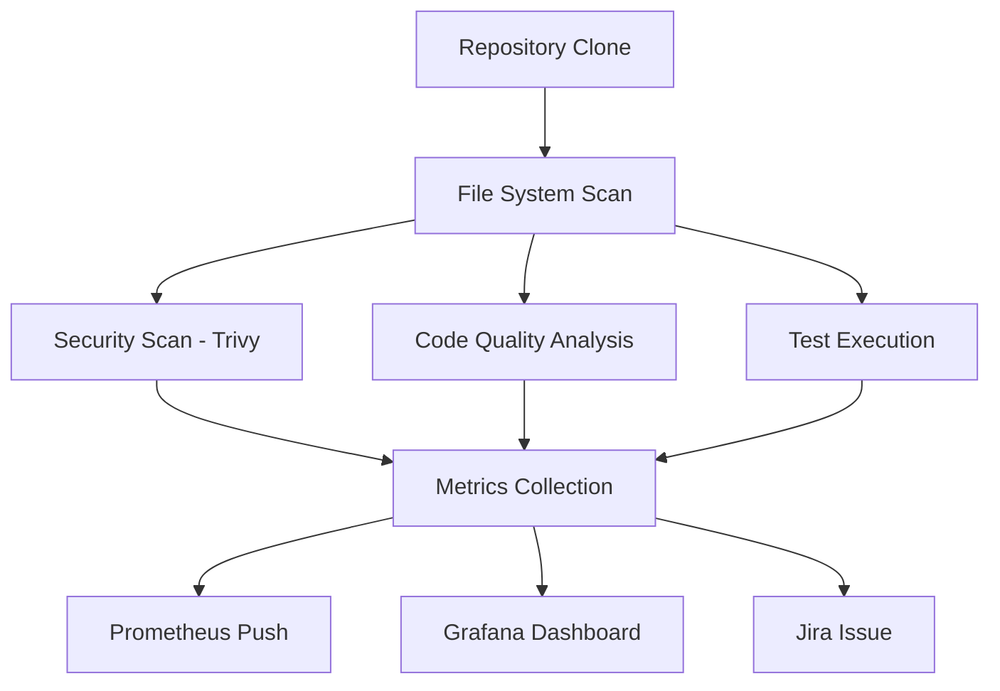
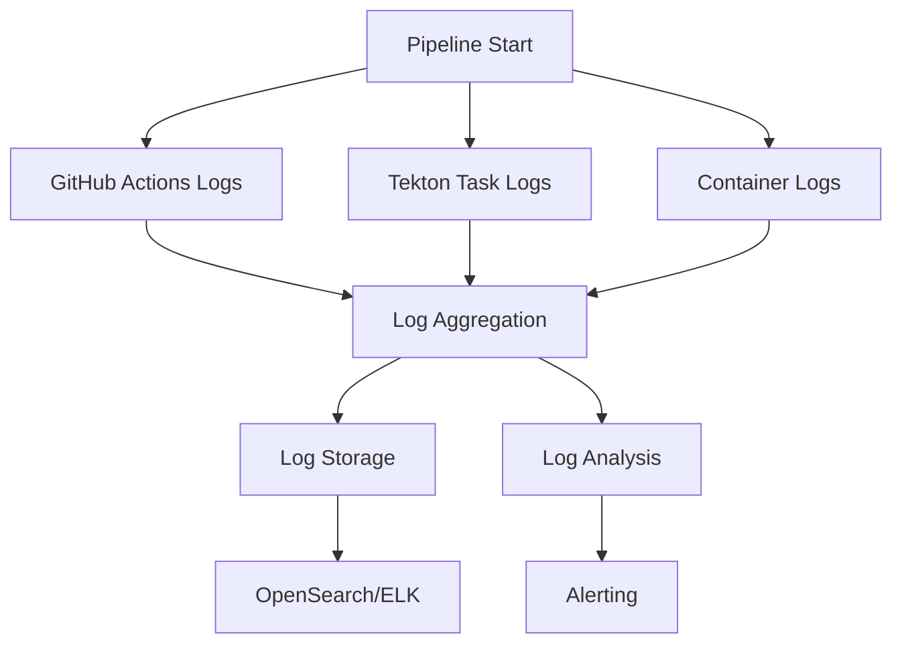

# 📊 How the Pipeline Pulls Logs and Metrics

## Overview
The ML Pipeline uses multiple methods to collect logs, metrics, and data from repositories and pipeline executions. Here's how it works:

## 🔍 **Log Collection Methods**

### 1. **GitHub Actions Logs**
**Location:** `.github/workflows/` files
**Method:** Built-in GitHub Actions logging + custom collection

```yaml
# Collect scan metrics from repository
cd external-repo
TOTAL_FILES=$(find . -type f -not -path '*/\.git/*' | wc -l)
TOTAL_LINES=$(find . -name '*.py' -o -name '*.js' -o -name '*.java' -o -name '*.go' -o -name '*.ts' -o -name '*.tsx' | xargs wc -l 2>/dev/null | tail -1 | awk '{print $1}' || echo "0")
REPO_SIZE=$(du -sh . | cut -f1)
```

### 2. **Kubernetes/Tekton Logs**
**Location:** `.github/workflows/tekton-pipeline.yml`
**Method:** `kubectl logs` commands

```bash
# Get logs from all tasks
mkdir -p pipeline-logs
for taskrun in $(kubectl get taskruns -n $TEKTON_NAMESPACE -l tekton.dev/pipelineRun=$PIPELINE_RUN_NAME -o jsonpath='{.items[*].metadata.name}'); do
  echo "📝 Collecting logs from $taskrun..."
  kubectl logs -n $TEKTON_NAMESPACE -l tekton.dev/taskRun=$taskrun --all-containers=true > pipeline-logs/${taskrun}.log || true
done
```

### 3. **Git Repository Data**
**Location:** `tekton/tasks/validate-commit-task.yaml`
**Method:** `git log` commands

```bash
COMMIT_AUTHOR=$(git log -1 --pretty=format:"%an <%ae>")
COMMIT_DATE=$(git log -1 --pretty=format:"%ci")
COMMIT_MESSAGE=$(git log -1 --pretty=format:"%s")

# Create changelog
git log -1 --pretty=format:"## [%h] %s%n%n**Author:** %an <%ae>%n**Date:** %ci%n%n%b" > /workspace/attestations/changelog.md
```

### 4. **GitHub API Data**
**Location:** `.github/workflows/scan-external-repos.yml`
**Method:** GitHub REST API calls

```bash
# Count actual pipeline runs from this repository
PIPELINE_RUNS=$(curl -s -H "Authorization: token ${{ secrets.GITHUB_TOKEN }}" \
  "https://api.github.com/repos/almightymoon/Pipeline/actions/runs" | \
  jq '.workflow_runs | length' 2>/dev/null || echo "0")

# Count successful runs
SUCCESSFUL_RUNS=$(curl -s -H "Authorization: token ${{ secrets.GITHUB_TOKEN }}" \
  "https://api.github.com/repos/almightymoon/Pipeline/actions/runs" | \
  jq '.workflow_runs | map(select(.conclusion == "success")) | length' 2>/dev/null || echo "0")
```

## 📈 **Metrics Collection Methods**

### 1. **File System Analysis**
**Script:** `push-real-metrics.sh`
**Method:** Direct file system scanning

```bash
# Count files and lines
TOTAL_FILES=$(find . -type f -not -path '*/\.git/*' | wc -l)
TOTAL_LINES=$(find . -name '*.py' -o -name '*.js' -o -name '*.java' -o -name '*.go' -o -name '*.ts' -o -name '*.tsx' | xargs wc -l 2>/dev/null | tail -1 | awk '{print $1}' || echo "0")
REPO_SIZE=$(du -sh . | cut -f1)
```

### 2. **Security Scan Results**
**Script:** `scripts/push_real_metrics.py`
**Method:** Parse scan output files

```python
def extract_metrics_from_jira_report():
    """Extract metrics from the Jira report text (fallback method)"""
    
    # Try to read from various possible locations
    possible_files = [
        '/tmp/quality-results.txt',
        '/tmp/scan-results.txt',
        '/tmp/pipeline-metrics.txt',
        'scan-results.txt',
        'quality-results.txt'
    ]
    
    for file_path in possible_files:
        if os.path.exists(file_path):
            try:
                with open(file_path, 'r') as f:
                    content = f.read()
                
                # Extract TODO/FIXME comments
                todo_match = re.search(r'TODO/FIXME comments: (\d+)', content)
                if todo_match:
                    metrics['quality']['todo_comments'] = int(todo_match.group(1))
```

### 3. **Prometheus Metrics Format**
**Method:** Create Prometheus-compatible metrics

```bash
# Create real metrics file for Prometheus
cat > /tmp/scan-metrics.txt << EOF
# HELP pipeline_runs_total Total pipeline runs
# TYPE pipeline_runs_total counter
pipeline_runs_total{repository="$REPO_NAME",status="total"} $PIPELINE_RUNS
pipeline_runs_total{repository="$REPO_NAME",status="success"} $SUCCESSFUL_RUNS
pipeline_runs_total{repository="$REPO_NAME",status="failure"} $FAILED_RUNS

# HELP external_repo_files_total Total files in scanned repository
# TYPE external_repo_files_total gauge
external_repo_files_total{repository="$REPO_NAME"} $TOTAL_FILES
EOF
```

## 🔄 **Data Flow Process**

### 1. **Repository Scanning**


### 2. **Log Collection Pipeline**


## 📊 **Metrics Types Collected**

### **Pipeline Metrics**
- Total pipeline runs
- Successful vs failed runs
- Pipeline duration
- Run frequency

### **Repository Metrics**
- Total files count
- Lines of code
- Repository size
- File types distribution

### **Security Metrics**
- Vulnerabilities by severity (Critical, High, Medium, Low)
- Security scan results
- Dependency vulnerabilities
- Secret detection results

### **Code Quality Metrics**
- TODO/FIXME comments count
- Debug statements count
- Large files count
- Code complexity metrics

### **Test Metrics**
- Tests passed/failed
- Test coverage percentage
- Test execution time
- Test categories

## 🛠️ **Tools Used for Data Collection**

### **Log Collection Tools**
- `kubectl logs` - Kubernetes pod logs
- `git log` - Git commit history
- `curl` - API calls to GitHub
- `find` - File system scanning
- `wc` - Line counting

### **Metrics Tools**
- **Prometheus** - Metrics storage and querying
- **Grafana** - Metrics visualization
- **Trivy** - Security vulnerability scanning
- **SonarQube** - Code quality analysis
- **GitHub API** - Repository metadata

### **Data Processing**
- **jq** - JSON processing
- **awk/sed** - Text processing
- **Python scripts** - Custom metrics extraction
- **Bash scripts** - Log aggregation

## 🔧 **Configuration**

### **Environment Variables**
```bash
# Log collection settings
export LOG_LEVEL="INFO"
export LOG_RETENTION_DAYS="30"

# Metrics collection settings
export METRICS_INTERVAL="60s"
export METRICS_TIMEOUT="30s"

# API endpoints
export GITHUB_API_URL="https://api.github.com"
export PROMETHEUS_URL="http://localhost:9090"
export GRAFANA_URL="http://localhost:3000"
```

### **Repository Configuration**
```yaml
# repos-to-scan.yaml
repositories:
  - url: "https://github.com/example/repo"
    name: "example-repo"
    branch: "main"
    scan_type: "full"  # full, security, quality, tests
```

## 📈 **Real-time Monitoring**

### **Live Log Streaming**
```bash
# Stream Kubernetes logs
kubectl logs -f deployment/pipeline-app -n pipeline-apps

# Stream GitHub Actions logs
gh run watch $RUN_ID
```

### **Live Metrics**
- Prometheus queries for real-time metrics
- Grafana dashboards with auto-refresh
- Alerting rules for threshold breaches

## 🎯 **Benefits of This Approach**

1. **Comprehensive Coverage** - Multiple data sources ensure nothing is missed
2. **Real-time Visibility** - Live logs and metrics for immediate feedback
3. **Historical Analysis** - Long-term trend analysis and reporting
4. **Automated Collection** - No manual intervention required
5. **Scalable Architecture** - Handles multiple repositories simultaneously
6. **Security Focus** - Built-in security scanning and vulnerability detection

This multi-layered approach ensures comprehensive visibility into your pipeline execution, repository health, and security posture!
