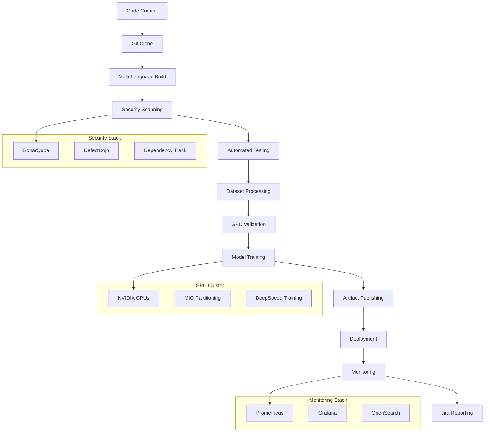

# Enterprise ML/AI CI/CD Pipeline

A comprehensive, enterprise-grade CI/CD pipeline for multi-language AI/ML projects with GPU acceleration, model parallelism, and advanced monitoring.

## 🚀 Features

### Core Capabilities
- **Multi-Language Support**: Python, Java, and ML projects
- **GPU Acceleration**: NVIDIA GPU support with MIG partitioning
- **Model Parallelism**: DeepSpeed and Megatron integration
- **Containerization**: Docker with NVIDIA Docker support
- **Orchestration**: Kubernetes with Tekton pipelines
- **GitOps**: ArgoCD for automated deployments

### Security & Quality
- **SAST/SCA**: SonarQube, DefectDojo, Dependency Track integration
- **Image Signing**: Harbor registry with signed images
- **Secret Management**: HashiCorp Vault integration
- **Policy Enforcement**: OPA Gatekeeper policies

### Monitoring & Observability
- **Real-time Metrics**: Prometheus + Grafana dashboards
- **GPU Monitoring**: DCGM metrics and alerts
- **Pipeline Tracking**: Tekton pipeline metrics
- **Log Aggregation**: OpenSearch integration

### Dataset Management
- **Continuous Preparation**: Automated dataset processing
- **JSON Format**: Structured dataset validation
- **Versioning**: Nexus artifact management
- **Quality Assurance**: Automated quality checks

### Integration
- **Project Management**: Jira integration for issue tracking
- **Notification**: Slack, Teams, email alerts
- **Reporting**: Automated test and performance reports

## 📋 Prerequisites

### Infrastructure Requirements
- **Kubernetes Cluster**: 1.24+ with GPU nodes
- **NVIDIA GPU Operator**: For GPU support
- **Tekton**: 0.45+ for CI/CD pipelines
- **ArgoCD**: 2.5+ for GitOps
- **Prometheus**: For monitoring
- **Harbor**: Container registry
- **Vault**: Secret management
- **Nexus**: Artifact repository

### GPU Requirements
- **NVIDIA GPUs**: Tesla V100, A100, or H100
- **CUDA**: 11.8+
- **cuDNN**: 8.6+
- **NVIDIA Docker**: For container runtime

### Software Dependencies
- **Python**: 3.9+
- **Java**: 17+
- **Node.js**: 18+ (for frontend components)
- **Docker**: 20.10+
- **Helm**: 3.8+

## 🏗️ Architecture



## 🚀 Quick Start

### 1. Clone the Repository
```bash
git clone https://github.com/yourorg/ml-pipeline.git
cd ml-pipeline
```

### 2. Install Prerequisites
```bash
# Install Tekton
kubectl apply -f https://storage.googleapis.com/tekton-releases/pipeline/latest/release.yaml

# Install ArgoCD
kubectl create namespace argocd
kubectl apply -n argocd -f https://raw.githubusercontent.com/argoproj/argo-cd/stable/manifests/install.yaml

# Install NVIDIA GPU Operator
helm repo add nvidia https://helm.ngc.nvidia.com/nvidia
helm repo update
helm install --wait gpu-operator nvidia/gpu-operator
```

### 3. Deploy the Pipeline
```bash
# Create namespaces
kubectl apply -f k8s/namespace.yaml

# Deploy GPU operator
kubectl apply -f k8s/gpu-operator.yaml

# Deploy the main pipeline
kubectl apply -f pipeline.yml

# Deploy monitoring
kubectl apply -f monitoring/prometheus-rules.yaml
```

### 4. Configure Secrets
```bash
# Create Harbor registry secret
kubectl create secret docker-registry harbor-creds \
  --docker-server=harbor.example.com \
  --docker-username=admin \
  --docker-password=password \
  --namespace=ml-pipeline

# Create Vault secret
kubectl create secret generic vault-token \
  --from-literal=token=your-vault-token \
  --namespace=ml-pipeline
```

### 5. Run Your First Pipeline
```bash
# Create PipelineRun
kubectl apply -f - <<EOF
apiVersion: tekton.dev/v1beta1
kind: PipelineRun
metadata:
  name: ml-pipeline-run-$(date +%s)
  namespace: ml-pipeline
spec:
  pipelineRef:
    name: enterprise-ml-pipeline
  params:
    - name: git-url
      value: "https://github.com/yourorg/your-ml-project.git"
    - name: project-type
      value: "ml"
    - name: gpu-count
      value: "2"
    - name: enable-model-parallelism
      value: "true"
  workspaces:
    - name: shared-data
      volumeClaimTemplate:
        spec:
          accessModes:
            - ReadWriteOnce
          resources:
            requests:
              storage: 10Gi
    - name: docker-credentials
      secret:
        secretName: harbor-creds
    - name: vault-secrets
      secret:
        secretName: vault-token
EOF
```

## 📁 Project Structure

```
pipeline/
├── pipeline.yml                 # Main Tekton pipeline definition
├── Dockerfile.python           # Python application container
├── Dockerfile.java             # Java application container
├── Dockerfile.ml               # ML/AI application container
├── configs/
│   ├── deepspeed.json          # DeepSpeed configuration
│   ├── model-config.yaml       # Model training configuration
│   └── dataset-transform.yaml  # Dataset processing configuration
├── schemas/
│   └── dataset-schema.json     # Dataset validation schema
├── k8s/
│   ├── namespace.yaml          # Kubernetes namespaces
│   ├── gpu-operator.yaml       # NVIDIA GPU operator
│   ├── ml-training-job.yaml    # Distributed training job
│   └── triton-inference.yaml   # Triton inference server
├── monitoring/
│   ├── prometheus-rules.yaml   # Prometheus alert rules
│   └── grafana-dashboard.json  # Grafana dashboard
├── security/
│   └── sonarqube-config.yaml   # SonarQube configuration
├── integrations/
│   └── jira-config.yaml        # Jira integration
└── README.md                   # This file
```

## 🔧 Configuration

### Pipeline Parameters

| Parameter | Description | Default | Options |
|-----------|-------------|---------|---------|
| `git-url` | Git repository URL | - | Any Git URL |
| `project-type` | Project type | `python` | `python`, `java`, `ml`, `multi` |
| `gpu-count` | Number of GPUs | `1` | `1-8` |
| `enable-model-parallelism` | Enable DeepSpeed | `false` | `true`, `false` |
| `dataset-version` | Dataset version | `latest` | Any version tag |
| `jira-project` | Jira project key | `ML` | Any project key |

### Environment Variables

```bash
# Required
export HARBOR_REGISTRY="harbor.example.com"
export SONARQUBE_URL="https://sonarqube.example.com"
export JIRA_URL="https://jira.example.com"
export PROMETHEUS_URL="https://prometheus.example.com"

# Optional
export ENABLE_GPU_MONITORING="true"
export ENABLE_MODEL_PARALLELISM="true"
export DATASET_CACHE_SIZE="100GB"
export MODEL_CACHE_SIZE="50GB"
```

## 🎯 Usage Examples

### Python ML Project
```yaml
apiVersion: tekton.dev/v1beta1
kind: PipelineRun
metadata:
  name: python-ml-pipeline
spec:
  pipelineRef:
    name: enterprise-ml-pipeline
  params:
    - name: git-url
      value: "https://github.com/yourorg/python-ml-project.git"
    - name: project-type
      value: "ml"
    - name: gpu-count
      value: "4"
    - name: enable-model-parallelism
      value: "true"
```

### Java Microservice
```yaml
apiVersion: tekton.dev/v1beta1
kind: PipelineRun
metadata:
  name: java-service-pipeline
spec:
  pipelineRef:
    name: enterprise-ml-pipeline
  params:
    - name: git-url
      value: "https://github.com/yourorg/java-service.git"
    - name: project-type
      value: "java"
```

### Multi-Language Project
```yaml
apiVersion: tekton.dev/v1beta1
kind: PipelineRun
metadata:
  name: multi-lang-pipeline
spec:
  pipelineRef:
    name: enterprise-ml-pipeline
  params:
    - name: git-url
      value: "https://github.com/yourorg/multi-lang-project.git"
    - name: project-type
      value: "multi"
    - name: gpu-count
      value: "2"
```

## 📊 Monitoring

### Grafana Dashboards
- **Pipeline Overview**: Pipeline status and metrics
- **GPU Utilization**: Real-time GPU usage and performance
- **Model Performance**: Training and inference metrics
- **Infrastructure**: Node and pod resource usage

### Prometheus Alerts
- **GPU High Utilization**: >90% for 10 minutes
- **Pipeline Failure**: Failed pipeline runs
- **Model Accuracy Low**: <80% accuracy threshold
- **Triton Server Down**: Inference server unavailable

### Key Metrics
- `dcgm_gpu_utilization`: GPU utilization percentage
- `tekton_pipelinerun_duration_seconds`: Pipeline execution time
- `ml_model_accuracy`: Model accuracy score
- `triton_inference_request_count`: Inference request rate

## 🔒 Security

### Image Security
- **Signed Images**: All images signed with Cosign
- **Vulnerability Scanning**: Trivy and Grype integration
- **Policy Enforcement**: OPA Gatekeeper policies

### Secret Management
- **Vault Integration**: Centralized secret storage
- **CSI Driver**: Kubernetes secret injection
- **Rotation**: Automated secret rotation

### Network Security
- **Network Policies**: Pod-to-pod communication rules
- **TLS Encryption**: End-to-end encryption
- **RBAC**: Role-based access control

## 🚀 Advanced Features

### GPU Partitioning (MIG)
```yaml
# Enable MIG on A100/H100 GPUs
apiVersion: nvidia.com/v1
kind: NodePolicy
metadata:
  name: mig-policy
spec:
  mig:
    strategy: "mixed"
    maxInstancesPerNode: 7
```

### Model Parallelism
```json
{
  "zero_optimization": {
    "stage": 2,
    "allgather_partitions": true,
    "overlap_comm": true
  },
  "fp16": {
    "enabled": true,
    "loss_scale": 0
  }
}
```

### Auto-scaling
```yaml
apiVersion: autoscaling/v2
kind: HorizontalPodAutoscaler
metadata:
  name: triton-hpa
spec:
  scaleTargetRef:
    apiVersion: apps/v1
    kind: Deployment
    name: triton-inference-server
  minReplicas: 2
  maxReplicas: 10
  metrics:
  - type: Resource
    resource:
      name: nvidia.com/gpu
      target:
        type: Utilization
        averageUtilization: 70
```

## 🐛 Troubleshooting

### Common Issues

#### GPU Not Available
```bash
# Check GPU operator status
kubectl get pods -n gpu-operator

# Check GPU nodes
kubectl get nodes -l nvidia.com/gpu.present=true

# Check GPU resources
kubectl describe node <gpu-node>
```

#### Pipeline Failures
```bash
# Check pipeline logs
kubectl logs -f <pipeline-run-name>

# Check task logs
kubectl logs -f <task-run-name>

# Check pod events
kubectl describe pod <pod-name>
```

#### Model Training Issues
```bash
# Check DeepSpeed logs
kubectl logs -f <training-job-pod>

# Check GPU utilization
kubectl exec -it <pod-name> -- nvidia-smi

# Check model performance
kubectl logs -f <model-validation-pod>
```

### Debug Commands
```bash
# Pipeline status
kubectl get pipelineruns -n ml-pipeline

# Task status
kubectl get taskruns -n ml-pipeline

# GPU status
kubectl get nodes -o jsonpath='{.items[*].status.allocatable.nvidia\.com/gpu}'

# Resource usage
kubectl top nodes
kubectl top pods -n ml-pipeline
```

## 📚 Additional Resources

### Documentation
- [Tekton Documentation](https://tekton.dev/docs/)
- [NVIDIA GPU Operator](https://docs.nvidia.com/datacenter/cloud-native/gpu-operator/)
- [DeepSpeed Documentation](https://www.deepspeed.ai/)
- [Triton Inference Server](https://docs.nvidia.com/deeplearning/triton-inference-server/)

### Examples
- [PyTorch Training Example](examples/pytorch-training/)
- [TensorFlow Serving Example](examples/tensorflow-serving/)
- [Multi-GPU Training Example](examples/multi-gpu-training/)

### Support
- **Issues**: [GitHub Issues](https://github.com/yourorg/ml-pipeline/issues)
- **Discussions**: [GitHub Discussions](https://github.com/yourorg/ml-pipeline/discussions)
- **Slack**: [#ml-pipeline](https://yourorg.slack.com/channels/ml-pipeline)

## 📄 License

This project is licensed under the MIT License - see the [LICENSE](LICENSE) file for details.

## 🤝 Contributing

1. Fork the repository
2. Create a feature branch (`git checkout -b feature/amazing-feature`)
3. Commit your changes (`git commit -m 'Add amazing feature'`)
4. Push to the branch (`git push origin feature/amazing-feature`)
5. Open a Pull Request

## 📞 Contact

- **Team**: ML Engineering Team
- **Email**: ml-team@example.com
- **Slack**: #ml-pipeline
- **Office Hours**: Every Tuesday 2-3 PM EST

---

**Built with ❤️ by the ML Engineering Team**
